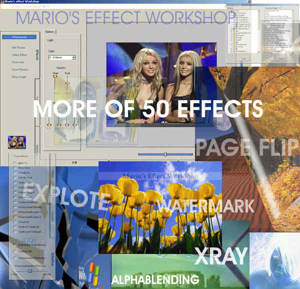



## Mario's Effect Workshop

### Description

Effects on the Fly with Mario's Effect Workshop do most of the common effects the fastes way (Scripting Java and VB script)...lots of them included,see how you can turn script to a powerfull tool to make awsome photos..

PLEASE TO RUN BE SURE TO READ THE README FILE...
 
### More Info
 

             |
---                |---
**Submitted On**   |2003-04-02 14:52:24
**By**             |[MArio Flores G](https://github.com/Planet-Source-Code/PSCIndex/blob/master/ByAuthor/mario-flores-g.md)
**Level**          |Advanced
**User Rating**    |5.0 (65 globes from 13 users)
**Compatibility**  |VB 6\.0
**Category**       |[Complete Applications](https://github.com/Planet-Source-Code/PSCIndex/blob/master/ByCategory/complete-applications__1-27.md)
**World**          |[Visual Basic](https://github.com/Planet-Source-Code/PSCIndex/blob/master/ByWorld/visual-basic.md)
**Archive File**   |[Mario's\_Ef156755412003\.zip](https://github.com/Planet-Source-Code/mario-flores-g-mario-s-effect-workshop__1-44407/archive/master.zip)

